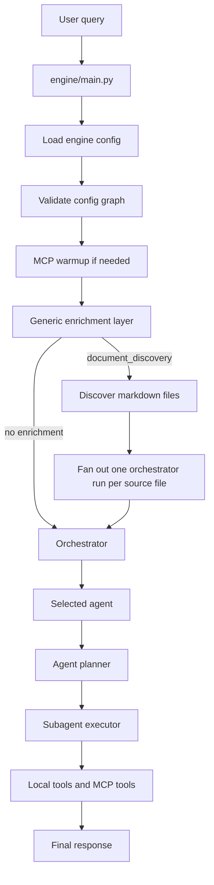

# Architecture

## Overview

This repository implements a YAML-driven, hierarchical agent system with three execution layers:

1. Orchestrator routes a request to one agent.
2. Agent plans and delegates to subagents.
3. Subagent executes tools or MCP calls.

The key design goal is to keep routing and behavior as config-first as possible. Adding a new capability should usually mean adding YAML files under `configs/`, not changing Python code.

## How The Solution Works

### Runtime Flow



### Main Execution Steps

- `engine/main.py` loads the config tree from `configs/`.
- `engine/core/graph.py` validates references, collisions, and pipeline rules.
- `engine/core/enrichment.py` decides whether a pre-orchestration enricher should run.
- `engine/roles/orchestrator.py` uses a structured LLM decision to choose the best agent.
- `engine/roles/agent.py` uses a structured agent loop to choose subagents.
- `engine/roles/subagent.py` uses native tool calling for local tools and MCP tools.
- `engine/core/react.py` enforces pipeline order and tool-call execution.

### Current High-Level Patterns

- Orchestrator selection is LLM-based, not keyword-based.
- Enrichment selection is LLM-based, with config-defined enrichers.
- Agent-to-subagent delegation is LLM-based, but constrained by `required_pipeline` when configured.
- Subagent-to-tool execution is explicit and bounded by declared dependencies.
- MCP tools are discovered at runtime and injected into the subagent tool list.

## Configuration Map

### Root Project Config Files

| File | Purpose |
| --- | --- |
| `pyproject.toml` | Python project metadata, dependencies, pytest config, and package discovery rules. |
| `docker-compose.langfuse.yml` | Local Langfuse stack for tracing, including PostgreSQL, ClickHouse, Redis, MinIO, web UI, and worker services. |

### Core Runtime Config Files

| File | Purpose |
| --- | --- |
| `configs/orchestrator.yaml` | Top-level orchestrator prompt. This is the only place where you guide routing behavior at the config level. The agent list itself is injected dynamically from loaded agent configs. |
| `configs/enrichers/document/document_workflow.yaml` | Local settings for markdown-based document processing. It defines the source directory, output directory, scan pattern, and watch interval used by the document enricher. |
| `configs/enrichers/document/document_discovery.yaml` | Generic enrichment config for document workflows. It tells the runtime to auto-discover markdown files and provide each one as `source_path` input to the orchestrator. |
| `configs/README.md` | Human-readable conventions for adding agents, subagents, tools, and MCP servers. |

### Agent Config Files

| File | Purpose |
| --- | --- |
| `configs/agents/math_agent.yaml` | Example agent for arithmetic tasks. Delegates to `calculator_subagent`. |
| `configs/agents/document_agent.yaml` | Document workflow agent. Delegates to `markdown_extractor -> agile_mapper -> trello_publisher` and uses a required pipeline to enforce order. |
| `configs/agents/trello_update_agent.yaml` | Trello update agent. Delegates to `trello_intake_parser -> trello_task_matcher -> trello_task_operator` and implements the 2-step confirm-before-mutate flow. |

### Subagent Config Files

| File | Purpose |
| --- | --- |
| `configs/subagents/calculator_subagent.yaml` | Uses the math tools to perform arithmetic. |
| `configs/subagents/markdown_extractor.yaml` | Reads a markdown source path and turns it into structured JSON. |
| `configs/subagents/agile_mapper.yaml` | Converts extracted markdown into a DocumentPlan JSON payload. |
| `configs/subagents/trello_publisher.yaml` | Publishes approved document plans to Trello through MCP. |
| `configs/subagents/trello_intake_parser.yaml` | Parses natural-language worklog text into structured Trello intent. |
| `configs/subagents/trello_task_matcher.yaml` | Searches Trello across boards/lists/cards and returns top candidate matches. |
| `configs/subagents/trello_task_operator.yaml` | Either returns a draft confirmation payload or mutates the confirmed Trello card. |

### Tool Config Files

| File | Purpose |
| --- | --- |
| `configs/tools/add.yaml` | Declares the `add` tool contract. |
| `configs/tools/multiply.yaml` | Declares the `multiply` tool contract. |
| `configs/tools/subtract.yaml` | Declares the `subtract` tool contract. |
| `configs/tools/read_markdown_structure.yaml` | Declares the markdown structure extraction tool contract. |

### MCP Config Files

| File | Purpose |
| --- | --- |
| `configs/mcps/trello.yaml` | Declares the Trello MCP server, connection settings, tool prefix, and allowed tool surface. |

## Why The Architecture Is Structured This Way

### Orchestrator Layer

The orchestrator chooses one agent per request. It does not know tool details. Its job is routing, not execution.

### Agent Layer

An agent is a workflow controller. It can call only the subagents listed in its dependencies, and `required_pipeline` can force a fixed order.

### Subagent Layer

A subagent is an execution unit. It can use:

- Local tools from `configs/tools/*.yaml`.
- Remote tools from MCP servers declared in `configs/mcps/*.yaml`.

### Enrichment Layer

Some workflows need input preparation before the orchestrator runs. For example, the document workflow needs markdown discovery so each file can be routed through the orchestrator. This is handled by `configs/enrichers/document/document_discovery.yaml` and the generic enrichment runtime.

## How Existing Workflows Fit Together

### Document Workflow

The document workflow is a three-stage pipeline:

1. `markdown_extractor` reads a markdown file and structures it.
2. `agile_mapper` turns that structure into a DocumentPlan.
3. `trello_publisher` publishes the plan into Trello.

When the document enricher is selected, the runtime discovers all matching markdown files and fans out one orchestrator run per file.

### Trello Update Workflow

The Trello update workflow is also a three-stage pipeline:

1. `trello_intake_parser` extracts work summary, requested operations, and matching hints.
2. `trello_task_matcher` finds the best matching cards.
3. `trello_task_operator` either returns a confirmation payload or applies the updates when a `confirmed_card_id` is available.

This workflow is intentionally safe: no mutation happens until the card is explicitly confirmed.

### Math Workflow

The math workflow is the simplest example:

- `math_agent` delegates to `calculator_subagent`.
- `calculator_subagent` uses `add`, `multiply`, and `subtract`.

## How To Add A New Agent

### Minimal Path

1. Create a new file in `configs/agents/`.
2. Set `role_type: agent`.
3. Give it at least one subagent dependency.
4. Write the system prompt to describe the workflow.
5. Set `required_pipeline` if the subagents must run in a strict order.
6. Add the needed subagent configs in `configs/subagents/`.
7. Add local tools in `configs/tools/` or MCP servers in `configs/mcps/` if the new subagents need them.
8. Run validation and tests.

### Example Agent Skeleton

```yaml
id: my_agent
role_type: agent
description: >
  Short summary of what the agent does.
system_prompt: >
  You are a workflow agent. Delegate to the right subagents and return only JSON.
dependencies:
  - my_first_subagent
  - my_second_subagent
required_pipeline:
  - my_first_subagent
  - my_second_subagent
max_steps: 8
```

### If The New Agent Needs Input Prep

If the agent needs pre-orchestration input preparation, add a new enricher file under `configs/enrichers/` and point it at a built-in or custom executor.

For example, the document workflow uses:

- `configs/enrichers/document/document_workflow.yaml` for source discovery settings.
- `configs/enrichers/document/document_discovery.yaml` to tell the runtime when to apply it.

## How To Add A New Subagent

1. Create a new file in `configs/subagents/`.
2. Set `role_type: subagent`.
3. Declare local tool dependencies in `dependencies`.
4. Declare MCP servers in `mcp_dependencies` if it needs remote tools.
5. Keep the system prompt focused on one job.
6. Use `max_steps` to bound runtime.

### Example Subagent Skeleton

```yaml
id: my_subagent
role_type: subagent
description: >
  Does one narrow task.
system_prompt: >
  You are a focused subagent. Return only JSON.
dependencies:
  - some_tool
mcp_dependencies:
  - some_mcp
max_steps: 5
```

## How To Add A New Tool

1. Implement the Python function in `engine/tools/` and register it with the tool decorator.
2. Add a YAML contract in `configs/tools/`.
3. Import the module from `engine/tools/__init__.py` so registration happens on startup.
4. Reference the tool from a subagent dependency list.

## How To Add A New MCP Server

1. Create a YAML file in `configs/mcps/`.
2. Define the transport, connection parameters, and optional `tool_prefix`.
3. Add `include_tools` or `exclude_tools` if you want to narrow the exposed MCP surface.
4. Reference the MCP server from a subagent via `mcp_dependencies`.

## Validation And Testing

Recommended commands:

```bash
python -m engine.main --validate configs
pytest tests/test_engine.py tests/test_graph.py tests/test_document_workflow.py tests/test_enrichment.py tests/test_pipeline.py -q
```

If you add a new config file, validate the graph first. If you add a new workflow, add a targeted test that proves the new routing behavior and any pipeline constraints.

## Practical Rules Of Thumb

- Add behavior in config before adding code.
- Keep each agent focused on one workflow.
- Use subagents for decomposition, not for cross-cutting routing.
- Use enrichers for input preparation, not for business logic.
- Keep tool contracts small and explicit.
- Use `required_pipeline` when order matters.
- Keep MCP tool exposure narrow.
